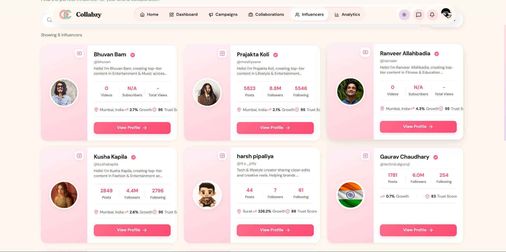
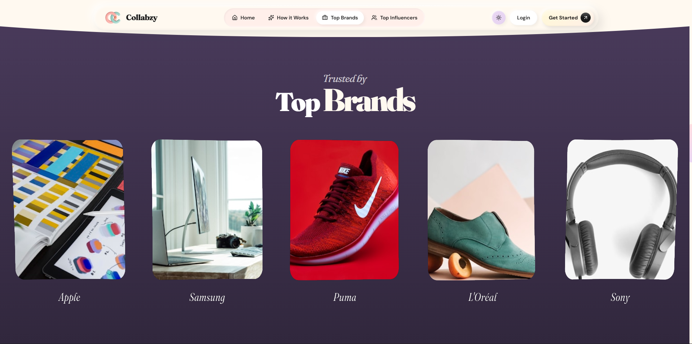
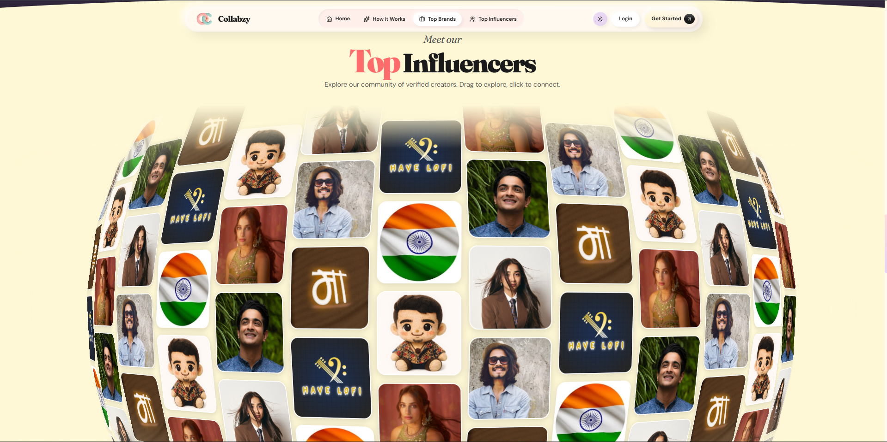
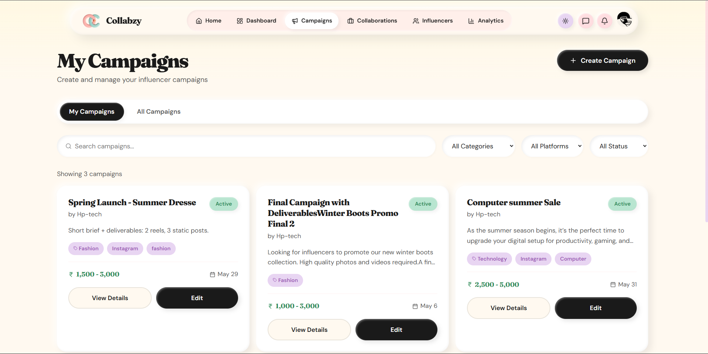
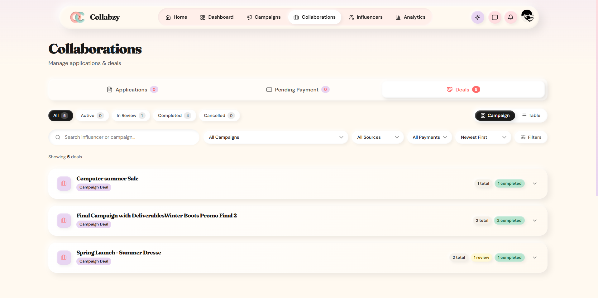

# Collabzy

Collabzy is a platform that helps Brands and Influencers work together easily.

Brands can create campaigns and find the right creators.
Influencers can explore campaigns, apply, and chat with brands.
Everything is managed in one place.

## What You Can Do

- Sign up and log in as Brand or Influencer
- Create and manage campaigns
- Discover influencers and brands
- Apply for collaborations
- Chat in real time
- Get notifications and updates
- Track deals and payment-related flows

## Website Preview

### Home Page


### Discover Influencers



### Top Brands



### Top Influencers



### Campaigns



### Collaboration



### Login Page


## Tech Stack

### Frontend

- React 19
- Vite 7
- React Router DOM
- Axios
- Socket.IO Client
- Framer Motion

### Backend

- Node.js
- Express.js
- MongoDB + Mongoose
- Socket.IO
- JWT + bcrypt
- Joi validation
- Razorpay integration

## Project Structure

```text
Collabzy/
|-- src/                     # Frontend app (React + Vite)
|-- public/                  # Static assets
|   `-- readme/              # README screenshots
|-- backend/
|   |-- config/              # DB, email, socket, security config
|   |-- controllers/         # Request handlers
|   |-- middleware/          # Auth, validation, ObjectId checks
|   |-- models/              # MongoDB models
|   |-- routes/              # API route definitions
|   |-- services/            # Business and integration services
|   |-- utils/               # Helpers
|   `-- server.js            # API entrypoint
`-- Details/                 # Planning and project documentation
```

## Features

### Authentication and Access

- Login and register system
- JWT based authentication
- OTP based auth support
- Role-based access control

### Campaign and Collaboration

- Brand campaign creation and management
- Influencer discovery and campaign applications
- Deal lifecycle management
- Reviews and trust-related scoring services

### Communication and Engagement

- Real-time chat with Socket.IO
- Notification system
- Message filtering service

### Monetization and Admin

- Payment flow and transaction tracking
- Wallet management
- Admin moderation and platform controls

## API Surface

Base URL:

- Backend API: `http://localhost:5000/api`

Key route groups:

- `/auth`
- `/influencer`
- `/brand`
- `/campaigns`
- `/applications`
- `/deals`
- `/messages`
- `/notifications`
- `/reviews`
- `/youtube`
- `/instagram`
- `/payments`
- `/wallets`
- `/admin`

Health check:

- `GET /api/health`

## Local Setup

### 1. Install frontend dependencies

```bash
npm install
```

### 2. Install backend dependencies

```bash
cd backend
npm install
```

### 3. Configure backend environment

```bash
cd backend
cp .env.example .env
```

Update `backend/.env` with your values:

- `MONGODB_URI`
- `JWT_SECRET`
- `YOUTUBE_API_KEY` (if using YouTube features)
- `INSTAGRAM_ACCESS_TOKEN` and related values (if using Instagram features)
- `RAZORPAY_*` values (if using payment flows)

### 4. Optional frontend environment

Frontend works with default local backend settings. If needed, set:

- `VITE_API_URL=http://localhost:5000/api`
- `VITE_SOCKET_URL=http://localhost:5000`

### 5. Start backend server

```bash
cd backend
npm run dev
```

### 6. Start frontend app

```bash
# from project root
npm run dev
```

Open the app at `http://localhost:5173`.

## Scripts

### Root (Frontend)

- `npm run dev` - Start Vite dev server
- `npm run build` - Production build
- `npm run preview` - Preview production build
- `npm run lint` - Run ESLint

### Backend

- `npm run dev` - Start backend with nodemon
- `npm start` - Start backend in normal mode
- `npm test` - Run backend smoke tests

## Current Project Status

- Backend APIs implemented with major platform modules
- Frontend pages and flows available
- Integration actively in progress/refinement in some areas

## Contributing

1. Fork the repository
2. Create a feature branch
3. Commit your changes
4. Open a pull request

## License

ISC
